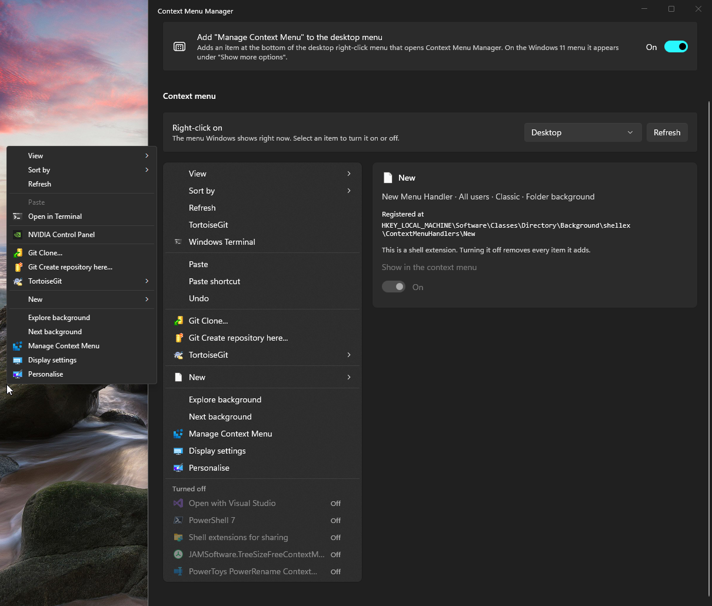
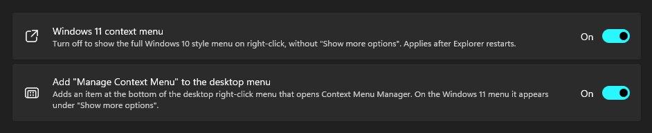
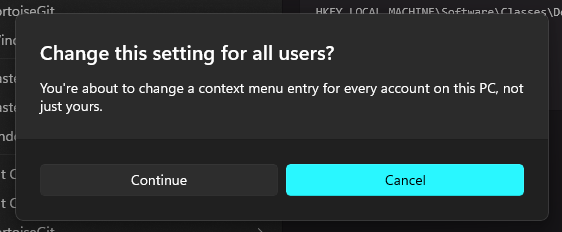
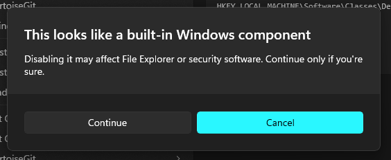
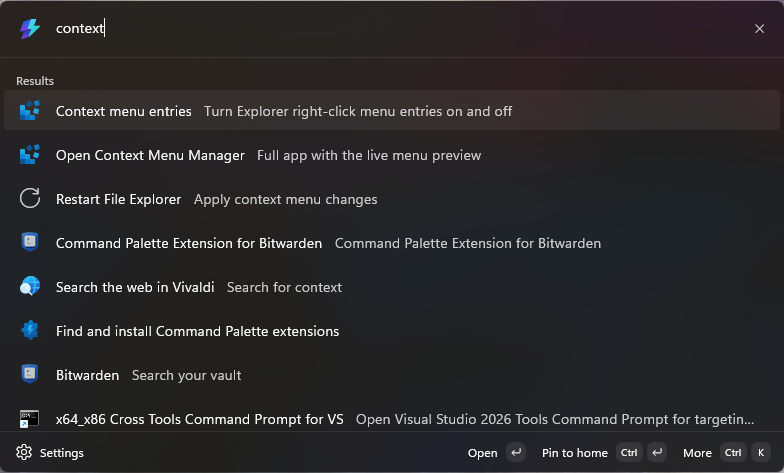
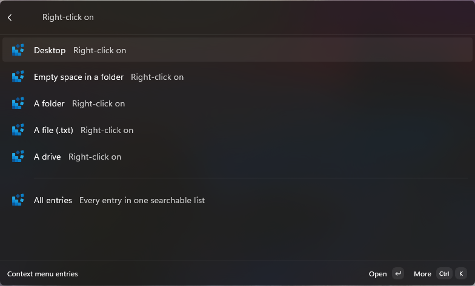
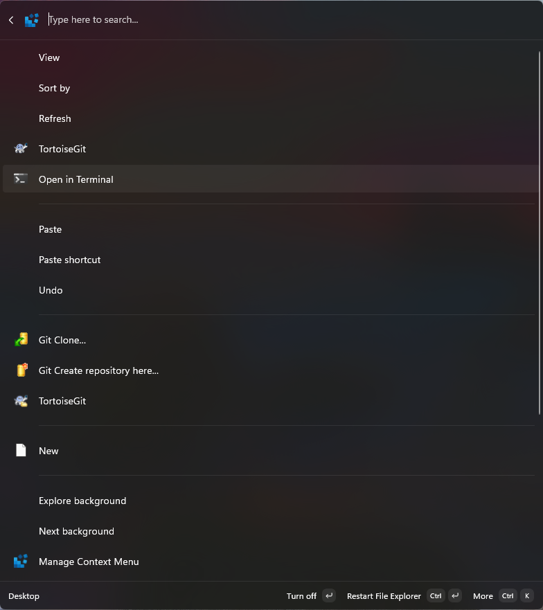
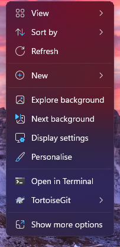

# Context Menu Manager

**Take back your Windows right-click menu.**

Every app you install adds something to the File Explorer context menu, and Windows 11 hides half of it behind "Show more options". Context Menu Manager shows you the real menu Windows builds, tells you where each item comes from, and lets you turn it off or back on. Nothing is deleted, so every change is reversible.

|  |
|---|

## Contents

- [Context Menu Manager](#context-menu-manager)
	- [Contents](#contents)
	- [Why use it](#why-use-it)
	- [The app](#the-app)
	- [Command Palette extension](#command-palette-extension)
	- [Install](#install)
		- [The app](#the-app-1)
		- [The Command Palette extension](#the-command-palette-extension)
	- [Unsigned software notice](#unsigned-software-notice)
	- [Help wanted: key art](#help-wanted-key-art)
	- [Build from source](#build-from-source)
	- [Project layout](#project-layout)
	- [Background](#background)

## Why use it

- **See the real menu.** Pick a target (desktop, folder background, folder, file, drive) and see exactly what Windows shows for it, including the entries hidden under "Show more options".
- **Find the culprit.** Click any item to see which registry key or package registered it.
- **Turn it off, not away.** No registry key is ever deleted. Switch an item off, and back on whenever you like.
- **Skip "Show more options".** One toggle brings the full classic menu back as the default.

<details>
<summary>What can be turned off</summary>

- **Classic shell extension handlers** (`...\shellex\ContextMenuHandlers`), per user and for all users.
- **Classic static verbs** (`...\shell\<verb>`), including cascading submenu items.
- **Windows 11 packaged entries** (sparse-package context menu extensions).
- **The Windows 11 menu itself**: switch back to the full classic menu.

</details>

## The app

The full experience: a live preview of the menu on the left, details and a switch for the selected item on the right.

- Turned-off entries collect in a "Turned off" group at the bottom of the preview, so you can always find them again.
- Explorer caches its menu, so changes show after File Explorer restarts. There is a button for that.
- All-users entries need administrator rights. Use **Restart as administrator** in the app.
- Warnings appear before you change something for every user, or disable something that looks like a built-in Windows component.

|  |
|---|

<details>
<summary>Safety prompts</summary>

| Change this setting for all users | This looks like a built-in Windows component |
|---|---|
|  |  |

</details>

## Command Palette extension

Prefer the keyboard? The extension for [PowerToys Command Palette](https://learn.microsoft.com/windows/powertoys/command-palette/overview) toggles entries without opening the app. Type `context` and go.

|  |
|---|

- **Context menu entries**: pick a target, then toggle items in a list that mirrors the real menu, with separators, submenus and a "Turned off" group.
- **All entries**: every entry in one searchable list.
- **Restart File Explorer**: apply your changes.
- **Open Context Menu Manager**: jump to the full app.
- All-users entries toggle through a UAC prompt.

|  |
|---|

<details>
<summary>More screenshots</summary>

The desktop menu inside Command Palette, and the same menu as Windows shows it on Windows 11:

|  |  |
|---|---|

</details>

## Install

### The app

Download the zip for your machine (`win-x64` or `win-arm64`) from [Releases](https://github.com/medallyon/ContextMenuManager/releases), extract it and run `ContextMenuManager.exe`.

<details>
<summary>Verify the download</summary>

Compare the zip against `SHA256SUMS.txt` on the release, or check that this repo's GitHub Actions built it:

```powershell
gh attestation verify .\ContextMenuManager-win-x64.zip -R medallyon/ContextMenuManager
```

</details>

### The Command Palette extension

The extension is an MSIX package, and a prebuilt one is not published yet because installing an MSIX needs a trusted signature. Until then, build it from [`src/ContextMenuManager.CmdPal`](src/ContextMenuManager.CmdPal) and sideload it with Windows Developer Mode on.

## Unsigned software notice

Context Menu Manager is **not code-signed yet**. Certificates cost money, and free open-source signing programs expect a project with some traction first. Until then:

- Windows SmartScreen may show "Windows protected your PC". Click **More info**, then **Run anyway**.
- Microsoft Defender may flag the download. It is a false positive that comes from the missing signature and from the app editing registry keys, which is what it is for.

<details>
<summary>Avoid the SmartScreen warning</summary>

Unblock the zip before you extract it:

```powershell
Unblock-File .\ContextMenuManager-win-x64.zip
```

The source is all here, and the release zips come from GitHub Actions with build attestations, so you can check exactly what you run.

</details>

If the project is useful to you, stars, issues and word of mouth are what get it signed.

## Help wanted: key art

The app and the Command Palette extension currently borrow the **PowerToys Registry Preview icon**. I'm using this as a placeholder and this project deserves its own face.

If you're an artist or designer and a fan of this project, please contribute a **key art icon** that works as both the Windows app icon and the Command Palette extension icon (it needs to read well from 16 px up to large tiles). Open an [issue](https://github.com/medallyon/ContextMenuManager/issues) or a pull request with your proposal. Credit goes right here!

## Build from source

Needs the .NET 10 SDK.

```powershell
dotnet publish src/ContextMenuManager.App -c Release -r win-x64 -p:Platform=x64 -o publish
```

Use `win-arm64` and `-p:Platform=ARM64` for ARM. The output is self-contained: copy the folder and run `ContextMenuManager.exe`.

## Project layout

- `src/ContextMenuManager.Core`: registry enumeration and toggling, packaged-entry enumeration, menu capture. No UI framework.
- `src/ContextMenuManager.MenuCapture`: console helper that builds the real Explorer menu in a separate process, so a crashing or hanging shell extension can't take the app down.
- `src/ContextMenuManager.App`: WinUI 3 app.
- `src/ContextMenuManager.CmdPal`: PowerToys Command Palette extension (MSIX-packaged).

## Background

Originally built as a PowerToys utility for [microsoft/PowerToys#33](https://github.com/microsoft/PowerToys/issues/33). That pull request was not accepted, so this is the standalone version. Licensed under MIT.
